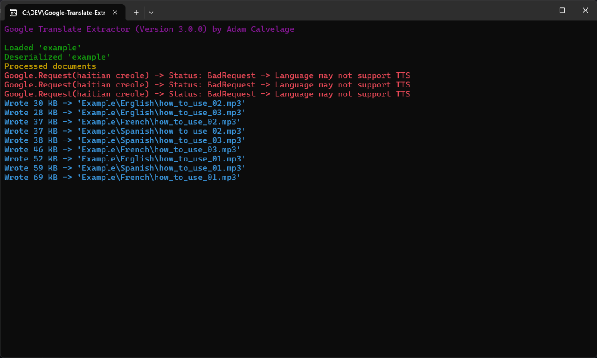

# Google Translate Extractor

This program utilizes JSON to quickly and easily generate TTS audio from [Google Translate](https://translate.google.com) that you may use for whatever purpose you desire.

## Usage
- Supported languages are located [here](https://github.com/LeftoverAtoms/Google-Translate-Extractor/blob/master/Scripts/Language.cs).
    - Submit a pull request for incorrect or missing entries.
- Define JSON files [here](Data/), you can have as many as you like.
    - Audio files will be saved to a folder based on your JSON file names. 
- Running this program will search through and briefly download audio using each JSON file.
- Use commas or spaces to add short or long pauses.

## Preview

