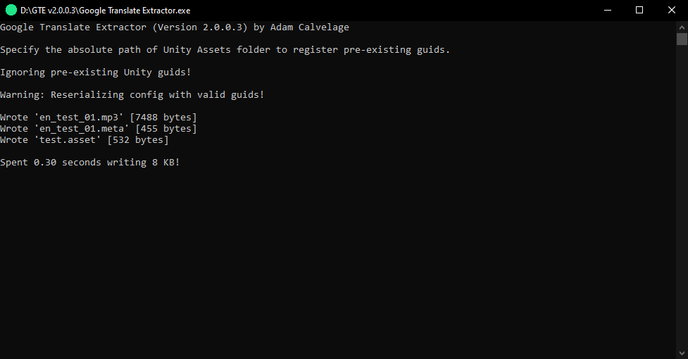

# Google Translate Extractor

Created to generate placeholder audio for Unity, but can be used for whatever purpose you desire.

## Usage

- Specifiy what you want Google Translate to output with the [config file.](Source/Config.json)
    - Tip: Use commas or spaces in your Subtitles to add short or long pauses between words.
- Run the program.
- Parse Unity GUIDs by inputing your Unity Assets path or just press enter to continue.
- Google Translate will then generate your audio and this program will download the data.

## Preview

